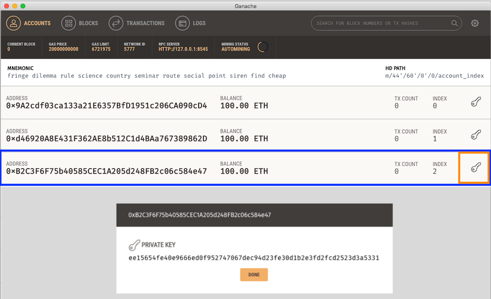

# STK-smart-contracts
Smart contracts for the STK token payment channel. This repo contains the logic to implement a Payment Channel using ERC20 Tokens. The files contained here are still in development and will be updated in the interests of functionality and security. This is *not* to be considered the final version. Code related comments can be sent to info@getstack.ca . We appreciate your feedback!

## Initialize

Install project dependencies

`npm install`   

## Local Development with Ganache CLI/Ganache UI Client

Our current development release uses the following versions: 
```
Truffle v4.1.8 (core: 4.1.8)

Solidity v0.4.23 (solc-js) 

Ganache CLI v6.0.3 (ganache-core: 2.0.2)
```

By default, the repo assumes that the third address is the Signer's address. This address is required for signing. **Note: Your address may be different than the one shown in the example below.** Copy and paste the private key of this address into `./test/ETHChannelClosing.js` and replace `signerPk` with the one on your local machine. Instructions for `Ganache` and `ganache-cli` are outlined below. 

### Ganache-UI Client  

To install, you can download the appropriate installation located here: http://truffleframework.com/ganache/. 

Should you use the Ganache UI Client, ensure you are using the private key of the third address from the top. You can access this value by clicking the button highlighted in red. 



### Ganache Command Line Interface 

To install, you can use `npm install -g ganache-cli`. 

Use the third private key address in the CLI. 

## Running Tests

Run tests using

`truffle test`

## Deploy to local testnet

This will also generate a deployedAddress.json for other application to read from

`ganache-cli`

`truffle compile`

`truffle migrate`

or run the following for new deployment

`truffle migrate --reset --compile-all`

## Deploy to live testnet (Rinkeby)

Before deploying to Rinkeby, please register on Infura

In your bash_profile Add INFURA_URL and MNEMONIC

`vim ~/.bash_profile`
`export MNEMONIC="<passphrase>"`
`export INFURA_URL=https://rinkeby.infura.io/<api-key>`

`truffle migrate --network rinkeby`
